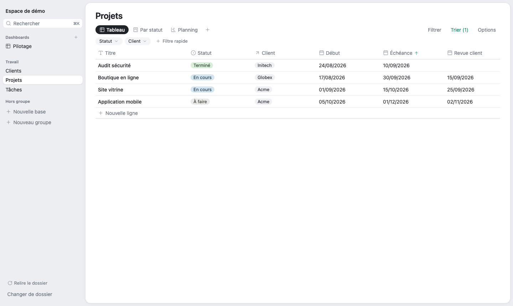
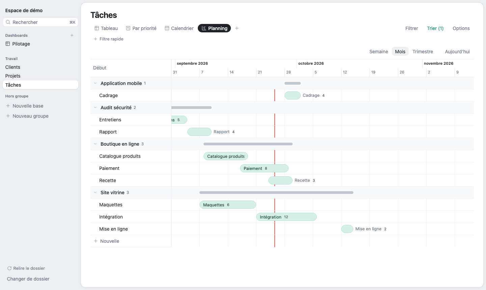

# mdbase

**Des bases de données comme dans Notion, rangées dans un dossier de fichiers Markdown que tu gardes.**

Tableaux, kanban, calendrier, timeline, relations entre bases, rollups, formules, dashboards : l'ergonomie des bases Notion, sans compte ni serveur. Chaque ligne est un fichier `.md` lisible, chaque réglage un petit fichier YAML. Le dossier se synchronise avec ce que tu utilises déjà (OneDrive, Dropbox, iCloud, git).

**[Essayer dans le navigateur](https://alexisraitano-myffu.github.io/mdbase/)** : clique sur « Essayer avec la démo », rien à installer ni à choisir (Chrome ou Edge). La démo vit dans le stockage du navigateur ; « Ouvrir un dossier » sert à tes vraies données, un dossier de ton disque.



> *English summary.* Notion-like relational databases whose only storage is a folder of Markdown + YAML files. A static web app (Chrome / Edge, File System Access API): no account, no server, nothing leaves your machine. The interface is in French for now. MIT licensed.

## Ce que ça fait

- **Bases et colonnes** : texte, nombre, date, case à cocher, choix simple ou multiple, lien, relation, rollup, formule. Création, renommage, réordonnancement et suppression depuis l'interface ; une base supprimée ne casse rien, les relations vers elle deviennent du texte.
- **Relations** entre bases, toujours bidirectionnelles, et **rollups** (somme, moyenne, comptes, pourcentages, dates…), y compris des rollups de rollups.
- **Formules** avec autocomplétion, erreurs en français et aperçu du résultat. Un interpréteur maison, qui n'exécute jamais de code venu des données.
- **Vues** enregistrées : tableau (groupement, calculs en pied de colonne), kanban, collection, calendrier, timeline avec jalons, qui peut se déplier le long des relations (un projet, ses versions, leurs jalons) ; barres colorées selon une colonne (le statut, la priorité) ou d'une couleur fixe. Filtres, tris et filtres rapides en pastilles.
- **Pages** : chaque ligne s'ouvre en panneau ou en plein écran, avec ses propriétés, ses onglets de relations et un contenu en Markdown.
- **Dashboards** qui rassemblent des vues de plusieurs bases, avec des filtres qui valent pour tous leurs blocs (un projet choisi filtre aussi ses tâches, par les relations), et une **recherche globale** (`Ctrl+K` ou `⌘K`).
- **Mode consultation** (`Ctrl+E` ou `⌘E`, ou l'icône en haut à droite) : tout passe en lecture seule, il ne reste que tes données, les onglets de vues et les filtres rapides.
- **Import et export** : une vue en tableau Markdown, en CSV ou en image PNG (la timeline entière, par exemple) ; un CSV en nouvelle base ou en lignes ajoutées.
- **Tableau comme dans un tableur** : sélection de lignes pour agir en lot (modifier, dupliquer, supprimer), plage de cellules tracée à la souris, copier-coller avec Excel ou du Markdown (en remplaçant ou en lignes nouvelles), poignée pour recopier une valeur, et annuler / rétablir (`Ctrl+Z`, `Ctrl+Maj+Z`).
- **Assistant IA** (`Ctrl+J` ou `⌘J`), désactivé par défaut. Tu lui demandes en français, il propose, tu confirmes :
  - **les données** : modifier ou créer des lignes (« passe les tâches en retard en priorité haute »), écrire le contenu d'une page ;
  - **la structure** : créer une base, ajouter, renommer ou supprimer des colonnes (relations, rollups et formules compris), créer ou régler des vues avec leurs filtres, tris et groupements (et pour une timeline : jalons, couleurs, niveaux dépliés par relation), créer des dashboards. Une colonne qu'il crée peut être remplie dans la même demande ;
  - **les suppressions** (lignes, colonnes, vues, dashboards, bases) : seulement si tu les demandes, en rouge dans l'aperçu avec ce qu'elles touchent.

  Rien n'est écrit avant « Appliquer », et un plan appliqué s'annule d'un `Ctrl+Z` (sauf ce qui a été supprimé dans la structure). C'est une conversation : il pose une question quand c'est ambigu, retient tes préférences et peut enregistrer des procédures nommées (skills) dans le dossier. Il se branche sur n'importe quel service compatible OpenAI, distant ou local (Ollama, LM Studio) : tu fournis l'adresse, ta clé et le modèle ; la clé reste dans ton navigateur.
- **Pensé pour la synchro** : relecture du dossier au retour sur l'onglet, écriture sûre quand un fichier a changé ailleurs, détection des copies de conflit OneDrive et des identifiants en double.



## Les fichiers

L'app crée et maintient tout. Rien n'est enfermé : le dossier se lit et se modifie aussi à la main.

```
MonEspace/
  _espace.yaml            barre latérale (groupes, ordre)
  _dashboards/pilotage.yaml
  projets/
    _schema.yaml          colonnes de la base
    _vues/planning.yaml   une vue par fichier
    _pages/defaut.yaml    mises en page
    site-vitrine--psite001.md
```

Une ligne :

```markdown
---
id: psite001
titre: Site vitrine
statut: En cours
client: cacme001
echeance: 2026-10-15
budget: 8000
---
## Objectif

Refaire le site vitrine avant le salon d'octobre.
```

Les valeurs calculées (relations inverses, rollups, formules) ne sont jamais écrites dans les fichiers : elles sont recalculées à l'ouverture. Un changement touche le moins de fichiers possible, pour limiter les conflits de synchro. Le format complet est décrit dans [docs/SPEC.md](docs/SPEC.md) (§3).

## Navigateurs

Chrome et Edge sur ordinateur : ce sont les seuls navigateurs qui donnent à une page web l'accès à un dossier local (File System Access API). Firefox et Safari affichent un message d'incompatibilité. L'app est 100 % statique : aucune télémétrie, et aucun appel réseau tant que l'assistant IA n'est pas activé (il n'appelle alors que le service que tu as choisi).

## Développer

```bash
npm install
npm run dev          # puis ouvrir http://localhost:5173 dans Chrome ou Edge
npm test             # tests du cœur (Vitest, dans Node)
npm run test:e2e     # tests de bout en bout (Playwright, Chrome sans fenêtre)
npm run typecheck
npm run build        # build statique dans dist/
```

Pour tester sur de vraies données sans risque, ouvre une copie de la démo : `cp -r exemples/espace-demo ~/essai`.

- `src/core/` : le cœur en TypeScript pur, sans React ni DOM (schéma, lecture tolérante, écriture préservant le formatage, relations, rollups, formules, filtres, recherche). Il tourne tel quel dans Node pour les tests.
- `src/adapters/` : l'accès aux fichiers (File System Access) et les services du navigateur.
- `src/ui/` : l'interface React.
- `docs/SPEC.md` : la spécification qui fait foi. `CLAUDE.md` : les conventions du projet.

Chaque push sur `main` passe le typage, les tests et les tests de bout en bout sur le build, puis publie l'app sur GitHub Pages.

Pour contribuer, en particulier pour brancher un outil tiers (autre hôte pour le dossier, fournisseur d'IA, format d'échange, service externe) : [CONTRIBUTING.md](CONTRIBUTING.md).

## État

La V1 décrite dans la spec est complète et la structure du produit est stable. Le nom est provisoire. La suite porte surtout sur les intégrations d'outils tiers.

## Licence

[MIT](LICENSE)
